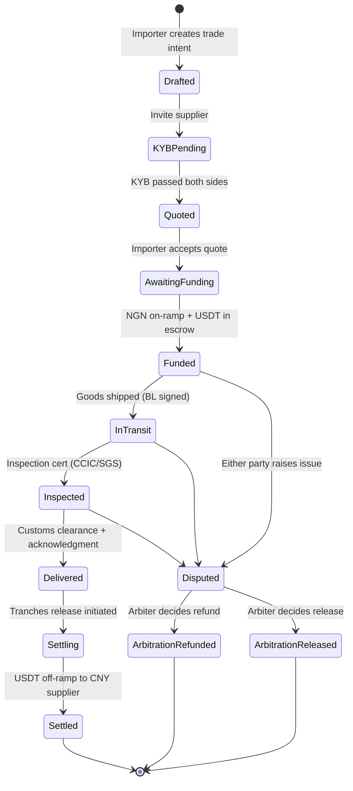
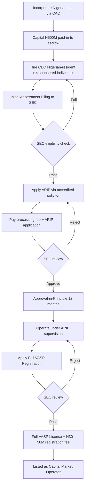
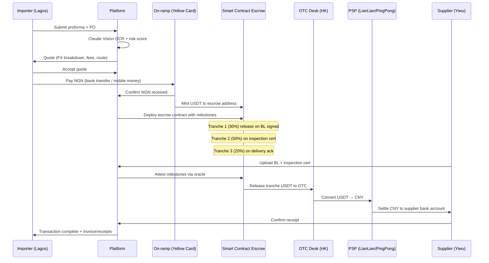

# Africa–China B2B Payment Corridor — Deep Research Report

**Pour : Oscar (Télécom Paris / X Entrepreneurship)**
**Date : 25 avril 2026**
**Scope : Plateforme fintech B2B SME pour le corridor Afrique–Chine, MVP Nigéria first**

---

## Executive Summary — 8 takeaways stratégiques

1. **Le marché est massif et accélère.** Le commerce Chine–Afrique a atteint **$348 milliards en 2025** (+17,7 % vs 2024), avec les exports chinois en hausse de 25,8 %. Le Nigeria seul a importé **$13 Md depuis la Chine en 2025** (+36,7 %). À 5–7 % de friction sur le segment SME, c'est un pool de rente de **$15–25 Md/an** que les acteurs traditionnels extraient encore.

2. **Le réglementaire Nigeria s'est durci en 6 mois et limite les options.** L'ISA 2025 + les nouvelles règles SEC de janvier 2025 imposent : minimum capital **₦500M (proposé ₦1B)**, registration fee **₦30M (proposé ₦50M)**, **CEO résident au Nigéria**, **60 % du board nigérian**, sponsored individuals approuvés par la SEC. Pas de raccourci pour un fondateur étranger sans co-founder local senior.

3. **XTransfer est le concurrent à neutraliser.** Unicorn $1B basé à Shanghai, **800 000 utilisateurs business**, croissance +300 % en Afrique en 2024, partenariats Flutterwave (Nigeria/Ghana/SA) et Ecobank (35 marchés). Ils ont déjà des comptes en monnaie locale au Nigeria et au Ghana, et un PMI Afrique de 53,7 %. **Si tu attaques ce marché, tu attaques XTransfer.** Mais ils n'ont pas la pile stablecoin + smart contract escrow — c'est ta différence.

4. **Stripe via Bridge a normalisé l'infra stablecoin globale.** Acquisition $1,1B finalisée en février 2025, déploiement dans 101 pays. Bridge orchestre désormais l'infrastructure pour les paiements stablecoin "invisibles". **Tu ne construis pas les rails, tu construis la couche d'orchestration trade finance + escrow conditionnel par-dessus.**

5. **Les patterns smart contract escrow sont matures.** OpenZeppelin `ConditionalEscrow` + `RefundEscrow`, Sablier streams, Safe modules — tous les primitives existent. Pour un escrow factory de ~1 500 lignes, **budget audit $40–80k** (Hacken/ChainSecurity tier) ou $25–50k via Code4rena contest. Le risque réel est dans **3 vecteurs spécifiques** : freeze Tether, key compromise multi-sig, oracle inspection corruption.

6. **Smart Order Routing → la littérature est claire mais l'implémentation OTC est un greenfield.** Cont-Kukanov 2014 reste la référence canonique pour le routage sur marchés fragmentés (formulation convexe). **Aucune librairie open-source ne traite le cas OTC/RFQ multi-source pour les paiements émergents.** Avantage technique défendable si tu codes proprement.

7. **L'écosystème VC est polarisé.** Côté stablecoin global : Castle Island, Variant, Dragonfly, Ribbit, Haun (qui ont fait Bridge à $200M post-money). Côté Africa : Oui Capital, Rally Cap, BKR Capital, P1, TLcom, Norrsken22 (qui ont fait Cauridor $3,5M). **Les meilleurs leads pour ton seed combinent les deux thèses** : Adaverse (Riyad, Cardano + Africa), Rally Cap (Africa + crypto-native), et indirectement Coinbase Ventures via cNGN.

8. **Avantage Mandarin = arbitrage exécution, pas marketing.** Le côté chinois (sourcing, OTC, KYB fournisseurs, intégration WeChat) n'est pas couvert proprement par Yogupay, Cauridor ou Yellow Card B2B. XTransfer le couvre car ils sont chinois. **Ta thèse défendable est : "le seul team avec talent technique africain ET accès opérationnel direct côté Chine."**

---

## 1. Market sizing — Nigeria, Kenya, et le corridor SME

### 1.1 Données macro consolidées (2024–2025)

| Corridor | Volume bilatéral | Imports africains depuis Chine | Source |
|---|---|---|---|
| **Chine ↔ Afrique total** | $348 Md (2025) | $225 Md | China-Global South Project, GACC |
| **Chine ↔ Afrique total** | $296 Md (2024) | $179 Md | SAIS-CARI, GBC |
| Nigeria ← Chine | $13 Md (2025), +36,7 % | (Nigeria total imports Asia: $21,7 Md) | NBS Nigeria via Finance in Africa |
| Nigeria ← Chine | $9,5 Md (2024) | — | NBS Nigeria |
| South Africa ↔ Chine | $52,5 Md (2024) | — | GACC |
| Égypte ↔ Chine | $17,4 Md (2024) | — | GACC |
| RDC ↔ Chine | $25,9 Md (2024), +37,8 % | — | GACC |

La trajectoire est sans ambiguïté : **les exports chinois vers l'Afrique ont crû 21,6 % en H1 2025** alors qu'ils contractaient vers l'Amérique du Nord et l'Europe. Le re-routage des excédents industriels chinois post-tariffs Trump amplifie le corridor — c'est un vent porteur structurel pour 5–10 ans.

### 1.2 Segment SME ($5k–$500k tickets) — modélisation

Aucune source publique ne désagrège proprement le segment SME. Mes triangulations à partir de XTransfer (qui cible exactement cette tranche) :
- Bill Deng (CEO XTransfer) chiffre **le ticket moyen B2B trade à $15 000–$20 000**.
- Avec $13 Md d'imports Nigeria→Chine en 2025, et en supposant que **40–60 % du flux est SME** (parts de marché des grands importateurs vs distributeurs), tu obtiens un TAM Nigeria-Chine SME de **$5,2–7,8 Md/an**.
- Au Nigeria seul, à raison de tickets moyens de $20k, cela représente **260 000 à 390 000 transactions/an** sur ce corridor.

**Répartition par catégorie produit (estimation Nigeria 2024, sources mixtes NBS + Andaman Partners) :**
- Électronique grand public et composants : ~30 %
- Machinerie industrielle et matériel BTP : ~25 %
- Textiles et habillement : ~12 %
- Solar panels (croissance +60 % YoY) : ~8 %
- Véhicules et pièces auto : ~10 %
- Autres (chimie, agro, plastiques) : ~15 %

### 1.3 Répartition des canaux de paiement actuels (Nigeria, estimation)

| Canal | Part estimée du flux SME | Friction totale (FX + frais + délai) |
|---|---|---|
| SWIFT correspondant banking | 50–60 % | 5–7,5 % |
| Hawala / fei qian (Guangzhou money shops) | 15–25 % | 3–7 % (mais illégal) |
| USDT P2P stablecoin (existant) | 8–15 % | 2–4 % (mais UX cassée) |
| Diaspora / money mules | 3–5 % | variable |
| Trade financing offshore (Maurice, Dubai) | 3–5 % | 1–3 % (mais réservé aux grands tickets) |

Chainalysis confirme que le **Nigeria a traité ~$22 Md de stablecoin entre juillet 2023 et juin 2024**, dont 85 % en transferts <$1M — preuve que le rail USDT P2P est massivement utilisé hors banking system. C'est ton signal d'adoption sous-jacent.

### 1.4 Sources et incertitudes

- **Sources primaires fiables** : SAIS-CARI (statistiques douanières chinoises), NBS Nigeria, McKinsey/Artemis Analytics ($390 Md global stablecoin payment volume 2025, 60 % B2B), Chainalysis Geography of Cryptocurrency, BVNK ($30 Md annualized stablecoin volume 2025).
- **Incertitudes notables** : la part exacte du hawala est non-documentable (par construction). Les chiffres des P2P USDT mélangent flux trading et flux trade. Le World Bank Remittance Prices ne couvre pas les corridors B2B SME proprement.

---

## 2. Regulatory roadmap — par juridiction

### 2.1 Nigeria — ISA 2025 et SEC

**Cadre légal en vigueur :**
L'**Investments and Securities Act 2025** (signé par Tinubu) reclasse les actifs numériques comme *securities*. La SEC Nigeria est régulateur unique des VASPs. La CBN a levé son interdiction bancaire en décembre 2023 ; les banques peuvent désormais servir les VASPs licenciés.

**Path d'enregistrement (3 phases obligatoires) :**

1. **Initial Assessment Filing** : formulaire SEC + draft white paper + opinion légale classifiant le token. La SEC notifie l'éligibilité au programme ARIP.
2. **Accelerated Regulatory Incubation Program (ARIP)** : sandbox supervisé, durée non-fixe, AIP (Approval-in-Principle) délivré pour 12 mois max. Pendant cette phase, l'opérateur peut servir des clients sous supervision.
3. **Full VASP Registration** : après la phase ARIP, application complète à la SEC.

**Exigences de capital et de gouvernance (rules de mars 2024 + amendements) :**
- Capital minimum : **₦500M (~$305k au taux actuel)**, proposé d'augmenter à **₦1B pour les digital asset firms**.
- Registration fee : **₦30M (~$18k)**, proposé d'augmenter à **₦50M (~$30k)**.
- **CEO/MD doit résider au Nigéria** ; mandat de 5 ans renouvelable une fois.
- **60 % des board members nigérians** ; majorité non-exécutifs.
- Sponsored individuals (min. 4) approuvés par la SEC, dont compliance lead.
- Initial Assessment doit inclure une legal opinion (~$5–15k chez Goldsmiths LLP, Templars, Aluko & Oyebode).

**Pénalités hors registration :**
- Amende minimale ₦10M (~$6 700) + ₦1M par mois de retard.
- Suspension/révocation possible.

**Verdict pratique pour Oscar :** **Tu ne peux pas être CEO d'une entité VASP nigériane en restant à Paris.** Il faut soit :
- (a) un co-founder nigérian senior comme CEO local (le path le plus défendable),
- (b) un montage holding offshore (Maurice ou Delaware) qui contracte avec une entité nigériane licenciée comme partenaire de distribution (mais tu hérites des contraintes de leur licence),
- (c) éviter le statut VASP en se positionnant comme "payment service" via la CBN IMTO (International Money Transfer Operator) ou comme "embedded technology provider" pour un VASP existant — mais cela exige une analyse au cas par cas avec un cabinet local.

### 2.2 Kenya — VASP Act 2025

**Cadre légal :**
- Bill voté le 7 octobre 2025, **assenti le 15 octobre 2025, en vigueur le 4 novembre 2025**.
- **Twin-Peak model** : CBK régule wallets / payment processors / stablecoin issuers ; CMA régule exchanges / brokers / advisors / tokenization.
- **Draft regulations publiés en mars 2026, consultation publique close le 10 avril 2026** — application en cours d'élaboration.

**Capital et fees (drafts) :**
- Stablecoin issuers : **Sh500M (~$3,8M)** — tu n'es probablement pas concerné si tu utilises USDT/USDC existants.
- Investment advisors : Sh2,5M (~$19 300).
- Licensing fees : Sh100k (~$770) à Sh2M (~$15 400) selon catégorie ; les plus chers sont les exchanges et payment processors qui handle stablecoins.

**Verdict pratique :** **Le Kenya est plus souple que le Nigeria sur le capital pour une payment firm B2B.** Pas de licence émise à ce jour (avril 2026). Bonne fenêtre pour entrer en Phase 2 (Q3 2026), avec un cabinet local type Anjarwalla, Bowmans, ou MMS Advocates.

### 2.3 France / EU — DSP2 + MiCA

**Option Institution de Paiement (ACPR, France) :**
- Capital initial : €125k (paiement seul) à €350k (avec fonds de garantie).
- Process ACPR : **9–18 mois en moyenne**, dossier ~200 pages.
- Avantage : **passporting EU dans tous les États membres**.
- Inconvénient : ne couvre pas les services VASP/crypto ; il faut un agrément MiCA séparé.

**Option agent EMI/PI :**
- Pas de licence propre, distribution sous licence d'un EMI existant (ex: Modulr, Modulr/Modulr Finance, etc.).
- Time-to-market : 4–6 semaines.
- Limites de volume contractuelles, dépendance opérationnelle au principal.

**MiCA pour la composante stablecoin (depuis 30 décembre 2024) :**
- ART (Asset-Referenced Tokens) et EMT (E-Money Tokens) : exigences strictes (Circle a fait son setup MiCA via Circle SAS en France, Tether a quitté le marché EU).
- Si tu es **utilisateur de stablecoin (orchestration)** et non émetteur, tu tombes sous CASP (Crypto-Asset Service Provider), pas ART/EMT.
- CASP : capital €50k–€150k, process ACPR/AMF.

### 2.4 Maurice (FSC) — option holding offshore

- License **Investment Dealer + Payment Intermediary Services** auprès de la FSC.
- Capital : USD 25 000–500 000 selon catégorie.
- Time-to-market : 4–8 mois.
- Avantage : neutre fiscalement, framework anglo-saxon, network avocats sophistiqués (BLC Robert, ENSafrica, Conyers).
- Bon choix pour la holdco du groupe.

### 2.5 Hong Kong — VATP/SVF

- License **Stored Value Facility** (SVF) : capital HK$25M (~$3,2M) — too heavy pour pre-seed.
- License **VATP** (Virtual Asset Trading Platform) : capital HK$5M, plus accessible mais réservé aux exchanges.
- Time-to-market : 12–18 mois.
- Stablecoins Bill effectif août 2025, demande 100 % reserve backing pour issuers.

**Verdict :** HK est trop cher au stage pre-seed. À considérer Phase 3 si tu veux servir des suppliers chinois sophistiqués avec compte HKD/USD natif.

### 2.6 Chine continentale — contraintes PBoC/SAFE

- **Le crypto trading reste interdit aux résidents chinois (notice 24 septembre 2021).** Toute activité de paiement stablecoin entrante depuis l'Afrique vers la Chine doit *off-ramp* avant d'arriver dans le système bancaire chinois.
- **Une WeChat Mini Program étrangère** ne peut pas opérer de payment service en CNY domestique sans license PBoC. Tu peux exposer une UI 中文 à des fournisseurs chinois pour : (a) lecture du statut transaction, (b) signing/upload de documents, (c) reception de notifications. Tout flux de fonds doit passer par un PSP licencié (LianLian, PingPong, AsiaPay) ou OTC desk HK.
- **WeChat Open Platform** : autorise les Mini Programs étrangères avec compte business chinois (IDD chinois ou HK). Setup ~3–6 mois, requiert un partenaire local pour le compte.

**Risque géopolitique / enforcement :** la position du PBoC sur les stablecoins reste hostile dans l'absolu mais permissive en pratique pour les flux *outbound* destinés aux exporters. **Tu dois absolument structurer pour que le compte de réception fournisseur soit un compte CNY domestique conforme** (via un PSP licencié), pas un wallet stablecoin.

### 2.7 Tableau de synthèse — sequencing recommandé

| Phase | Juridiction | License | Délai | Capital | Coût legal counsel |
|---|---|---|---|---|---|
| 1 (Q3 2026) | Maurice | FSC IDPS / IS Cat 4 | 4–6 mois | $50–100k | $30–60k |
| 1 (Q4 2026) | Nigeria | SEC ARIP via partenaire local | 3–6 mois | ₦125M (25 % du capital) en escrow | $40–80k |
| 2 (Q2 2027) | Kenya | CBK Payment Processor (post-regulations) | 6–9 mois | TBD (~$50–200k) | $30–50k |
| 2 (Q3 2027) | EU | CASP via France | 9–12 mois | €50–150k | €60–120k |
| 3 (2028+) | Hong Kong | VATP ou SVF | 12–18 mois | HK$5–25M | HK$300–500k |

---

## 3. Competitive intelligence — deep dive

### 3.1 Tableau comparatif consolidé

| Acteur | Fondé | Funding total | Valuation | Géographie | Architecture | Pricing | Faiblesse exploitable |
|---|---|---|---|---|---|---|---|
| **XTransfer** | 2017 | $168M (6 rounds) | $1B (Sep 2021) | Chine + 200 pays, focus Africa H2 2025 | Banking partnerships (JPM, DB, HSBC) + XNet propriétaire | Free intra-XTransfer ; FX -80 % vs banking | Pas de stablecoin ; pas d'escrow programmable ; UX lourde côté African importer |
| **Bridge.xyz (Stripe)** | 2022 | $58M pré-acq + acquired $1,1B | (acquired) | 101 pays via Stripe | Orchestration USDB stablecoin + APIs | API model, % sur volume | Pas SME-specific ; pas de produit trade finance ; pas d'UX 中文 |
| **Conduit** | ~2021 | $36M Series A (May 2025, Dragonfly + Circle) | $150–250M est. | LATAM + Africa + Asia | Stablecoin orchestrator, 15+ currencies, 100+ pays | $10B annualized TPV (16x growth 2024) | Très B2B core, peu de focus Africa-China spécifique ; pas d'inspection / escrow conditionnel |
| **Yellow Card** | 2016 | $88M+ (incl. $33M Series C Oct 2024 led Blockchain Capital) | nd | 34 pays incl. 20 africains + Brazil/India/Mexico/China/SG/HK | On/off-ramp licencié, B2B-pivot complet (exit retail nov 2025) | $3B trading volume 2024 (2x 2023) | Pas d'escrow programmable ; pas de produit dédié corridor Chine ; orchestrateur de liquidité, pas plateforme trade |
| **AZA Finance** (ex-BitPesa) | 2013 | $40M+ (acquired by dLocal pending) | nd | Africa + G20 currencies | B2B FX & payments | Quote-based | En cours d'acquisition par dLocal — fenêtre de distraction stratégique |
| **LianLian Global** | 2003 (China) / 2015 (Global) | $300M+ | $5B (IPO HK 2023) | China + global | PSP licencié 60+ countries | 0,3–1 % FX margins typique | Cible cross-border ecommerce, pas trade traditionnel ; peu d'expertise Africa |
| **PingPong** | 2015 | $100M+ | $1B+ | China + global | PSP licencié | Similaire LianLian | Idem LianLian |
| **Cauridor** | 2022 | $3,5M seed (Jan 2025, Oui Capital) | $15–25M est. | Francophone West Africa + agents | Hybrid agent network + digital | TPV $500M (2024) | Pas de corridor Chine ; pas de stablecoin (en exploration) ; ticket size <$5k typiquement |
| **Yogupay** | ~2022 | nd (stealth) | nd | East Africa, expanding | Stablecoin WaaS + on/off-ramp | nd | Faible traction publique ; positionnement marketing-heavy ; pas de produit escrow programmable |
| **Bitnob** | 2020 | $1,5M seed | nd | Nigeria + East Africa | Bitcoin Lightning + stablecoin | Consumer remittance-focused | Pas B2B trade |
| **Wave** (Senegal) | 2018 | $200M+ | $1,7B (Series A 2021) | XOF zone + extension | Mobile money | Consumer P2P fees ~1 % | Pas B2B trade ; pas Asia corridor |
| **Grey** | 2020 | $3M seed | nd | Africa-EU/US payouts | Virtual accounts USD/EUR/GBP | nd | Side opposé du corridor (recevoir, pas payer la Chine) |
| **Importa** | 2022 | <$1M | nd | Brazil-China (similaire concept) | Stablecoin escrow B2B | nd | Tu peux étudier leur produit comme analogue ; LATAM only |
| **Marble** | 2023 | seed nd | nd | Africa stablecoin | Wallet-as-a-Service | nd | Infrastructure layer, pas vertical |

### 3.2 Analyse stratégique compétitive

**La pression vient de XTransfer.** Si tu attaques Lagos en 2026, tu rencontres XTransfer dès le pitch fournisseur. Leurs forces : licences chinoises propres, banking partnerships top-tier, 800k users. Leurs faiblesses : pas d'escrow programmable, pas de stablecoin natif, et — crucialement — **leur produit est conçu pour le SME chinois exportant, pas pour le SME africain important.** L'asymétrie d'expérience UX existe et est exploitable.

**Bridge/Stripe est l'infrastructure, pas un concurrent direct.** Tu peux *t'appuyer sur* Bridge pour l'on/off-ramp côté US et certains marchés africains. Ils n'ont aucune intention de faire le vertical "trade finance Africa-China" ; c'est le métier de fournisseurs de couche supérieure.

**Yellow Card a fait le pivot B2B exact en 2025, mais reste un orchestrateur de liquidité.** Pas de couche escrow conditionnel, pas d'inspection, pas de trade finance. **Yellow Card est ton meilleur partenaire potentiel** (on-ramp Naira → USDT) plutôt qu'un concurrent direct.

**Conduit est très proche de ce que tu veux faire mais joue LATAM-first.** Leur Africa play est récent (partenariat Onafriq février 2026 pour USDC). Si Conduit accélère sur Africa-China, tu perds 12 mois d'avance.

**Le terrain "Africa-China + escrow programmable + smart routing" est encore non-occupé.** C'est la fenêtre.

---

## 4. Partner ecosystem — qualified shortlist

### 4.1 OTC desks (off-ramp USDT → CNY)

Les sources publiques sur le pricing OTC sont limitées (le secteur opère en dark pool). Voici les noms à contacter :
- **FalconX** (Hong Kong + Singapore) : tier-1 institutional, capacity $10M+, KYB strict, spreads 5–15 bps sur USDT-USD, mais USDT-CNY off-ramp via partner.
- **Wintermute** (London + Asia desk) : MM tier-1, capacity tier-1, KYB strict.
- **B2C2** : market maker, capacity et KYB strict.
- **Cumberland (DRW)** : Chicago/Asia desks.
- **Bitget OTC** : APAC-focused, KYB plus accessible, spreads compétitifs sur USDT-CNY informel.
- **OSL Digital Securities** (HK, licensed) : SFC-regulated, le plus "compliant" des OTC desks asiatiques, capacity moyenne.
- **Hashkey OTC** (HK) : licensed, growing.

**Engagement playbook :**
1. Identifie 3 desks tier-2/tier-3 prêts à signer un memorandum of understanding pré-volume.
2. Négocie un service-level agreement avec : spread max (target 25–50 bps), settlement window (T+0 idéal), KYB simplifié pour les transactions <$100k.
3. Multi-source : ne dépends jamais d'un seul desk (failure mode = key compromise ou banking issue chez le desk).

### 4.2 PSPs licenciés Chine pour settlement

| PSP | License | Spécialité | Pricing approximatif |
|---|---|---|---|
| **LianLian Global** | PBoC + 60+ countries | Cross-border ecommerce | 0,3–1 % FX margin + transaction fee |
| **PingPong** | PBoC + global | Marketplace sellers | Similaire |
| **XTransfer** | PBoC + global | B2B trade SME | Free intra-XTransfer, FX margin 0,3–0,5 % |
| **AsiaPay** | HK + China | Merchant acquiring | nd |
| **Airwallex** | HK + global, $330M Dec 2025 | Multi-currency accounts | 0,4–1 % FX |

**Stratégie :** ne tente pas d'intégrer XTransfer (concurrent). LianLian Global et PingPong sont les plus probables partenaires (ils ont besoin de flux Africa-bound pour diversifier leurs sources). Airwallex est plus difficile (très product-led, peu de partnerships externes).

### 4.3 African on-ramps — qualified shortlist

| Provider | License (Nigeria) | API | Geographic spread | Notes |
|---|---|---|---|---|
| **Yellow Card** | ARIP track | Mature B2B API (yellowcard.io/api) | 20 African countries | Le plus avancé pour stablecoin B2B |
| **Onafriq (ex-MFS Africa)** | Multiple | Mature | Pan-African | Partenariat Conduit Feb 2026 |
| **Bitnob** | Smaller scale | API basic | Nigeria + East Africa | Lightning-native |
| **Quidax** | SEC-approved (ARIP) | API | Nigeria-first | Approval initial Nigeria stablecoin work |
| **Busha** | SEC-approved (ARIP) | API | Nigeria-first | Listed cNGN |
| **AZA Finance** | Multiple | Mature | Pan-African | dLocal acquisition pending |
| **Mono** (open banking) | CBN-licensed | Mature | Nigeria | Pour bank account aggregation |
| **Okra** (open banking) | CBN-licensed | Mature | Nigeria | Pour bank account aggregation |
| **Stitch** (open banking) | South Africa-led | Mature | Pan-African | Alternative à Mono |

### 4.4 KYC/KYB providers

| Provider | Spécialité | Pricing approximatif (volume tier) |
|---|---|---|
| **Sumsub** | Global, Africa+Asia coverage | $0,8–2,5/check selon volume + setup $2–5k |
| **Onfido** | Global, ID-heavy | Similaire |
| **Veriff** | Strong on emerging markets | $0,5–2/check |
| **ComplyAdvantage** | Sanctions/PEP screening | Subscription $10–50k/an |
| **Smile Identity** | Africa-native (Nigeria, Kenya, SA) | $0,30–1,50/check |

**Recommendation :** Sumsub ou Smile ID + ComplyAdvantage pour la stack KYB Nigeria. Smile ID a de meilleurs match rates sur les BVN (Bank Verification Number) Nigeria.

### 4.5 Inspection-as-a-service (third-party)

- **SGS** : leader mondial, API limitée mais possible via comptes corporate. Fees inspection : $300–800/inspection selon scope.
- **Bureau Veritas** : similaire, présence Asie forte.
- **CCIC** (China Certification & Inspection Group) : leader chinois, **partenaire critique pour vérification fournisseur côté Chine.** Pricing similaire.
- **Cotecna** : alternative pour Africa-bound shipments, certifications government-mandated.

**Pour ton MVP escrow conditionnel :** intégrer SGS ou CCIC en V1 est trop ambitieux. Commence par un manual workflow où l'inspection certificate (PDF) est uploadé par le buyer/fournisseur et validé par Claude Vision OCR + revue humaine.

---

## 5. Smart contract escrow — patterns, audit, sécurité

### 5.1 Reference implementations

**OpenZeppelin** fournit la base :
- `Escrow.sol` (utils/escrow/) : base contract, holds funds for payee, withdrawal pattern.
- `ConditionalEscrow.sol` : abstract, releases only if `withdrawalAllowed(payee)` returns true. **C'est ton point de départ.**
- `RefundEscrow.sol` : multi-party deposits, owner can close period and trigger refund-or-release flow.

**Sablier** (sablier.com / GitHub sablier-labs) :
- Streams continus (linear or Lockup) pour payments salariaux, vesting.
- Modèle LL (Lockup Linear) et LD (Lockup Dynamic) pertinents pour le **release multi-tranche conditionnel** : tu peux modéliser la libération de fonds échelonnée selon des milestones logistiques (BL signé, container scellé, customs clearance, livraison).
- Audit history exemplaire (Spearbit, ChainSecurity, Cantina).

**Llamapay** : streaming protocol minimaliste, focus payroll, moins pertinent pour escrow conditionnel mais code lisible.

**Safe (ex-Gnosis Safe) modules** :
- Module pattern : tu peux écrire un *escrow module* pour un Safe multi-sig où le Safe lui-même tient les fonds, et le module exécute la logique de release conditionnelle (oracle-driven, multisig-driven, ou time-driven).
- Avantage : tu hérites de la sécurité du Safe (le plus audité multi-sig de la chaîne EVM).
- **C'est le pattern recommandé pour la V1 production**, plutôt qu'un escrow contract custom from scratch.

### 5.2 Architecture smart contract proposée

```
EscrowFactory (déployé une fois)
  ├── deploy(buyer, seller, arbiter, milestones[], totalAmount)
  └── Crée TradeEscrow

TradeEscrow (1 par transaction commerciale)
  ├── State: Funded → InTransit → Inspected → Delivered → Released | Disputed
  ├── Tranches: [milestone1: 30%, milestone2: 50%, milestone3: 20%]
  ├── Conditions par tranche:
  │     ├── BL hash signé par carrier
  │     ├── Inspection report attesté par oracle (CCIC/SGS API)
  │     └── Acknowledgment buyer
  ├── Dispute: arbiter (multisig 2-of-3 buyer/seller/platform) peut force-resolve
  ├── Timeout: après N jours sans action, auto-refund vers buyer
  └── Hook: onRelease() trigger off-chain settlement (off-ramp PSP)

Oracle (pluggable)
  ├── ChainlinkExternalAdapter pour SGS/CCIC API
  ├── Manual attestation par signed message du compliance officer
  └── Fallback: timelocked default
```

### 5.3 Vecteurs d'attaque spécifiques et mitigations

| Vecteur | Risque | Mitigation |
|---|---|---|
| **USDT freeze (Tether blacklist)** | Tether peut blacklist une address. Si l'escrow est blacklisté, fonds figés. | (a) Whitelist d'addresses validées au déploiement ; (b) Mécanisme "emergency redirect" multi-sig pour transférer fonds vers un escrow alternatif si freeze détecté ; (c) Mirror sur BNB Chain/Polygon avec swap automatique en cas d'événement. |
| **Multi-sig key compromise** | Vol de clé arbiter ou platform | Hardware wallets obligatoires (Ledger/GridPlus) ; rotation tous les 6 mois ; threshold 2-of-3 minimum, idéalement 3-of-5 avec time-delay. |
| **Oracle corruption (inspection report)** | Faux rapport d'inspection signé | Multi-oracle agreement (SGS + CCIC doivent attester) ; commit-reveal scheme ; bug bounty sur les attestations fausses. |
| **Reorg / finality (Tron)** | Reorganisation chain plus rare sur Tron mais possible | 19 confirmations recommandées avant marquage "settled" off-chain ; mirror events sur EVM chain pour cross-verification. |
| **Reentrancy sur withdraw** | Classic attack | OpenZeppelin `ReentrancyGuard` + checks-effects-interactions pattern ; pull-payment plutôt que push-payment. |
| **Signature replay** | Signature inspection report rejouée | EIP-712 typed signatures + nonce + chain ID + contract address dans le hash. |
| **TVM vs EVM opcode differences** | Bug subtil entre Solidity sur Ethereum et Tron | Tester *intégralement* sur Nile (Tron testnet) ; ne pas assumer parité 100 %. Revues croisées TronGrid + Foundry forge tests. |
| **Energy/Bandwidth depletion (Tron)** | Le contract peut devenir un-callable si TRX staked insuffisant | Frozen TRX pour Energy + monitoring ; fallback EVM mirror si Tron resource issue. |

### 5.4 Audit firms — pricing 2025–2026

| Firme | Tier | Prix indicatif (1500 LoC escrow factory) | Lead time | Spécialité |
|---|---|---|---|---|
| **Trail of Bits** | Top | $120–300k | 8–16 sem queue | DeFi infra, ZK, complex protocols |
| **OpenZeppelin** | Top | $80–200k | 4–10 sem | EVM standards, blue-chip DeFi |
| **ChainSecurity** | Top | $80–180k | 6–12 sem | Used by Tether, Circle, MakerDAO, TRON DAO |
| **Spearbit** | Top (network model) | $32k–48k/sem × 2–4 sem = $65–190k | 1–4 sem | Custom team selection |
| **Cyfrin** | Mid-Top | $40–120k | 2–8 sem | EVM DeFi, growing |
| **Hacken** | Mid | $25–80k | 1–3 sem | Mainstream EVM, 1500+ projets, bon TRON support |
| **Quantstamp** | Mid | $40–130k retainer 10 weeks | 2–6 sem | Multi-chain, faster turnaround |
| **Code4rena (Zellic)** | Contest | $37k–120k pool, 96 % refund si pas de H/M | 1–4 sem | Crowd-sourced, broad coverage |
| **Sherlock** | Contest+coverage | similar Code4rena + insurance layer | 1–4 sem | Coverage product unique |

**Stratégie audit recommandée pour ton stage :**
1. **Pre-launch (avant TGE/mainnet)** : audit Hacken ou Cyfrin (~$50k, 3 sem) — donne crédibilité institutionnelle sans casser la banque.
2. **Code4rena contest 7 jours** (~$40–60k) en parallèle — coverage large, payment conditionnel sur findings.
3. **Bug bounty Immunefi continu post-launch** : 5–10 % du value-locked, capped.
4. **Re-audit après 6 mois** ou avant changement majeur — Spearbit en mode mission ciblée.

**Total budget audit Year 1 : $120–180k**, lissé sur 3 phases. C'est le coût de la confiance institutionnelle.

---

## 6. Smart Order Routing — academic foundations + practical adaptation

### 6.1 Références académiques canoniques

| Paper | Auteurs | Année | Apport central |
|---|---|---|---|
| **Optimal control of execution costs** | Bertsimas & Lo | 1998 | Formulation dynamique de l'execution scheduling ; impact linéaire |
| **Optimal Execution of Portfolio Transactions** | Almgren & Chriss | 2000 | Trade-off coût vs risque avec mean-variance ; impact temporary + permanent ; **canonique** |
| **Optimal Trading Strategy and Supply/Demand Dynamics** | Obizhaeva & Wang | 2006 (publié 2013) | Order book shape function ; resilience |
| **Competition for Order Flow and Smart Order Routing Systems** | Foucault & Menkveld | 2008 | Premier modèle théorique du SOR sur exchanges fragmentés |
| **Optimal Order Placement in Limit Order Markets** | Cont & Kukanov | 2014 (final) | **Formulation convexe + stochastic approximation pour fragmenté** ; ton point de départ direct |
| **Optimal Execution Strategies in Limit Order Books with General Shape Functions** | Alfonsi, Fruth, Schied | 2010 | Generalization shape functions |
| **Censored Exploration and the Dark Pool Problem** | Ganchev, Nevmyvaka, Kearns | 2010 | RL applied to dark pool routing |
| **Universal features of price formation: Deep Learning** | Sirignano & Cont | 2018 | Deep learning sur LOB dynamics |

### 6.2 Adaptation au cas OTC/RFQ paiements émergents

Le défi : **les references ci-dessus assument un Limit Order Book continu (LOB)**, mais ton problème est OTC multi-source avec :
- Prix discret et négocié (RFQ — Request for Quote).
- Capacity caps par source (chaque OTC desk a un limite de $X par jour).
- Prix time-varying selon disponibilité dollar dans le pays émergent.
- Heterogeneous settlement times (T+0 sur certains, T+1 sur d'autres).
- Compliance constraints (certains desks refusent transactions <$10k ou >$500k).

**La formulation convexe canonique adaptée :**

```python
# Variables de décision : x_i = montant alloué à source i
# Coût total : 
#   sum_i (price_i * x_i + slippage_i(x_i) + fee_i + delay_penalty_i)
# où slippage_i(x_i) = alpha_i * x_i^0.5 (square-root impact, calibré ML)

import cvxpy as cp
import numpy as np

def solve_routing(target_ngn, sources):
    """
    sources: list of dicts with keys:
      - mid_price (USDT/NGN ratio)
      - depth (max NGN executable T+0)
      - spread (bps)
      - alpha (slippage coefficient calibrated by XGBoost)
      - delay_seconds (expected settlement)
      - delay_penalty_per_sec (lambda_t)
    """
    n = len(sources)
    x = cp.Variable(n, nonneg=True)
    
    explicit_cost = sum(
        s['mid_price'] * x[i] * (1 + s['spread']/10000) 
        for i, s in enumerate(sources)
    )
    
    slippage = sum(
        s['alpha'] * cp.power(x[i], 1.5)  # cp doesn't allow non-DCP power, use approx
        for i, s in enumerate(sources)
    )
    
    delay_penalty = sum(
        s['delay_penalty_per_sec'] * s['delay_seconds'] * x[i]
        for i, s in enumerate(sources)
    )
    
    obj = cp.Minimize(explicit_cost + slippage + delay_penalty)
    
    constraints = [
        sum(x) == target_ngn,
        *[x[i] <= s['depth'] for i, s in enumerate(sources)],
    ]
    
    prob = cp.Problem(obj, constraints)
    prob.solve(solver='ECOS')
    return x.value, prob.value
```

**Note technique :** `cp.power` avec exposant non-affine n'est pas DCP. En pratique il faut linéariser par morceaux ou utiliser `cp.huber` / `cp.quad_over_lin` selon la forme exacte de slippage. La calibration de `alpha_i` par source via XGBoost à partir de données historiques de fills devient ton edge.

### 6.3 Internal netting — strategic differentiator

**Wise traite ~$140 Md/an de volume cross-border.** Ils netting *internement* une fraction massive — chiffre exact non-public, mais industrie estime 40–70 % du flux ne touche jamais correspondent banking grâce au netting.

**Pattern que tu peux répliquer à plus petite échelle :**
- Tenir des balances pré-fundées dans chaque pays target (NGN, KES, XOF, CNY via LianLian/PingPong).
- Pour chaque transaction inbound (USDT entrant), check si tu peux *net* contre un outbound pending dans la même paire/heure.
- Le netting reduces ton on-chain footprint et réduit les frais externes.

À ton stage, c'est trop tôt — il faut $50–100M de TPV avant que netting devient material. Mais **architecte ta DB pour rendre ça facile dès le V1 :** chaque transaction a une `netting_eligible_until` timestamp et un `counterparty_currency` indexé.

### 6.4 Open-source references

- **CCXT** (github.com/ccxt) : exchange connector library, utile pour quote aggregation sur les exchanges crypto (Binance, OKX, Bitget, Bybit).
- **Hummingbot** (github.com/hummingbot) : MM bots, contient des SOR primitives.
- **OpenBB Terminal** : research platform, bon pour calibration historique.
- **CVXPY tutorials** : docs.cvxpy.org/en/stable/examples — formulations convexes classiques.

Pas de référence directe pour "SOR multi-source paiement émergent" — c'est ton greenfield.

---

## 7. Funding landscape — recent rounds + investor map

### 7.1 Comparable rounds 2024–2026

| Company | Round | Date | Lead | Total raised | Valuation | Traction at funding |
|---|---|---|---|---|---|---|
| **Bridge** (pré-Stripe) | Series A $40M | Mar 2024 | Ribbit + Index + Sequoia + Haun | $58M | $200M post-money | Stablecoin orchestration, Coinbase + SpaceX clients |
| **Conduit** | Series A $36M | May 2025 | Dragonfly (+ Circle Ventures) | ~$50M | $150–250M est. | $10B annualized TPV (16x growth) |
| **Cauridor** | Seed $3,5M | Jan 2025 | Oui Capital | $3,5M | nd | $500M TPV 2024, 2M tx 2023 |
| **Yellow Card** | Series C $33M | Oct 2024 | Blockchain Capital | $88M+ | $200–300M est. | $3B trading volume 2024 |
| **BVNK** | Multi-round | 2024–2025 | Visa Ventures + Citi Ventures + Tiger | nd | $1B+ unicorn | $30B annualized 2025 |
| **Airwallex** | Series F $330M | Dec 2025 | nd | $1B+ | $5B+ | nd |
| **Continental Stablecoin Inc. (cNGN)** | SAFE | Sep 2025 | Coinbase Ventures + Adaverse | nd | nd | 600M cNGN minted |

### 7.2 VCs to target — qualified by thesis fit

**Tier 1 — Africa fintech + crypto-friendly :**
- **Adaverse** (Riyad, Cardano + Africa + stablecoin focus, has invested in cNGN, 300 startups target). Vincent Li.
- **Rally Cap** (US, Africa-focused crypto, did Cauridor + others).
- **Oui Capital** (Pan-African, did Cauridor lead).
- **BKR Capital** (Canada/Africa, did Cauridor).
- **P1 Ventures** (US/Africa, fintech-heavy).
- **Norrsken22** (Africa scale-ups).
- **TLcom Capital** (London/Africa).
- **Partech Africa** (Pan-African scale fund).

**Tier 1 — Stablecoin global infrastructure :**
- **Castle Island Ventures** (Boston, ex-Fidelity, written stablecoin papers, $250k–$1M checks). Nic Carter / Matthew Walsh.
- **Variant Fund** (NYC, crypto-native).
- **Dragonfly** (Conduit lead, US/Asia).
- **Haun Ventures** (Bridge Series A).
- **Ribbit** (Bridge Series A).
- **Coinbase Ventures** (cNGN, plus largement Africa).
- **Circle Ventures** (Conduit Series A).
- **Visa Ventures** (BVNK).
- **Citi Ventures** (BVNK).

**Tier 2 — Strategic angles :**
- **Stripe** (via Bridge ecosystem partnerships).
- **Tether** (selective strategic investments, contact via Paolo Ardoino's office).
- **Yellow Card** (potential strategic / corp dev).
- **Flutterwave** (corp dev for distribution).

### 7.3 Pitch deck patterns qui fonctionnent (post-mortems + founder essays)

D'après les rounds Bridge / Conduit / Cauridor / Yellow Card + interviews TechCabal :
1. **Hook : taille du corridor + friction actuelle quantifiée** ("$348B trade Africa-China, 5–7 % friction = $20B+ rent extracted").
2. **Pain point persona** (un "Chinedu" ou "Bola" précis, pas une abstraction).
3. **Insight non-trivial** ("ça ne se résout pas avec plus de stablecoin ; ça se résout avec orchestration + escrow").
4. **Architecture** (un slide schéma 4 layers).
5. **Demo product** (ou Loom video du flow MVP).
6. **Traction** — pour pre-seed, c'est OK d'avoir : 10 LOI signées, 3 design partners, $X de pipeline qualifié.
7. **Team** — c'est *crucial*. Combine technical (toi) + commercial Nigerian + (idéalement) Chinese. Solo founder = -30 % valuation au minimum.
8. **Regulatory roadmap** (slide dédié, montre que tu comprends le path Nigeria).
9. **Unit economics** — show LTV/CAC > 30 et payback < 3 mois.
10. **Use of funds** — clair, milestones, 18 mois runway.

### 7.4 Avantage Mandarin-speaking founder — comment le pitcher

Les VCs valorisent l'avantage opérationnel concret, pas l'avantage culturel théorique. Manières de framer :
- "I can do supplier KYB in 中文 directly, without translator latency. Reduces onboarding time from 14 days to 3 days."
- "I have direct relationships with [3 Yiwu trading houses, 2 Shenzhen electronics distributors] who serve as design partners and validation channel."
- "I can negotiate OTC desk relationships in Shenzhen / HK in Mandarin, securing tighter spreads than competitors."
- "WeChat Mini Program development is in-house; competitors outsource and lose 6 months."

C'est de la *traction Mandarin* et non du *story Mandarin*.

---

## 8. Stack architecture — recommandations détaillées

### 8.1 Stack proposée (validation et coûts)

| Layer | Choice | Pricing à 10k tx/mois | Pricing à 100k tx/mois | Notes |
|---|---|---|---|---|
| Frontend (web) | Next.js + Vercel | $20/mois Pro | $200–500/mois | Multilang FR/EN/中文 via next-intl |
| Frontend (mobile-first) | Next.js PWA + Capacitor | included | included | Évite App Store frictions au début |
| WeChat Mini Program | Native (uni-app option) | one-time $5–15k dev | nd | Phase 2 |
| Backend orchestration | FastAPI on Modal | $50–200/mois | $500–2000/mois | Modal pour async workloads + ML |
| Async workers | Inngest | $20/mois starter | $200/mois | Pour pipelines event-driven |
| Database | Supabase (Postgres + Auth + Storage) | $25/mois Pro | $100–500/mois | RLS pour multitenancy |
| Auth | Clerk | $25/mois + per MAU | $100–500/mois | Si tu veux dépasser Supabase Auth |
| Vector DB | Pinecone | $70/mois starter | $500/mois | Pour RAG conversational copilot |
| LLM | Anthropic Claude API (Sonnet 4.5) | ~$30 / 10k tx (vision OCR + agent) | ~$300 / 100k tx | Voir 8.2 |
| Smart contracts | Solidity + Foundry, Tron primary | $0 dev, gas variable | gas variable | TRX staking pour Energy |
| Multi-sig | Safe (sur EVM mirror) + custom on Tron | $0 | $0 | |
| Monitoring | Tenderly + custom | $50/mois | $200/mois | On-chain monitoring critical |
| Compliance | ComplyAdvantage subscription + Sumsub | $1,5–3k/mois | $3–8k/mois | Sanctions + KYC |

**Total infra à 10k tx/mois : ~$1 500–3 000/mois**
**Total infra à 100k tx/mois : ~$5 000–10 000/mois**

À comparer aux $300k–500k de coûts personnel (3 ingénieurs + 1 compliance) : l'infra n'est pas le bottleneck.

### 8.2 AI agent architecture — Claude Sonnet 4.5 deep dive

**Document intake (Vision OCR pour proforma invoice, BL, packing list, PO) :**

```python
# Pseudocode — utilise l'API Anthropic Claude Sonnet
import anthropic

def parse_proforma(pdf_bytes):
    client = anthropic.Anthropic()
    response = client.messages.create(
        model="claude-sonnet-4-5",
        max_tokens=4000,
        messages=[
            {
                "role": "user",
                "content": [
                    {"type": "document", 
                     "source": {"type": "base64", 
                                "media_type": "application/pdf", 
                                "data": base64_pdf}},
                    {"type": "text", "text": EXTRACTION_PROMPT_WITH_SCHEMA}
                ]
            }
        ],
        system=COMPLIANCE_AWARE_SYSTEM_PROMPT
    )
    return parse_json(response.content[0].text)
```

**Coût estimé par transaction (intake complet) :**
- Vision OCR proforma + BL + packing list (~10k tokens input, 1k tokens output) : ~$0,03–0,05 par transaction.
- Conversational copilot turn (RAG retrieve from Pinecone + 2k input + 500 output) : ~$0,01 par message.
- Risk scoring agent (XGBoost feature gen + verification) : ~$0,005 per tx.

**À 10k tx/mois × 5 messages copilot moyens + 1 intake : ~$50–80/mois en LLM.**
**À 100k tx/mois : ~$500–800/mois.**

Très favorable. Claude est le bon LLM pour ce use case parce que :
- Vision native excellent pour documents commerciaux.
- Tool use mature pour l'agent orchestration.
- Multilingual FR/EN/中文 plus solide que GPT pour le mandarin technique commercial.

**Architecture multi-agent recommandée :**
```
Intake Agent (Sonnet vision)
  → Parse proforma/BL/PO into structured data
  → Output: TradeIntent JSON

Risk Agent (Sonnet + tools)
  → Tools: ComplyAdvantage check, Tianyancha fournisseur lookup, sanctions list
  → Output: RiskScore + flags

Quote Agent (Sonnet + Python solver)
  → Tool: solve_routing(target, sources_snapshot)
  → Output: Quote with breakdown

Execute Agent (Sonnet + on-chain tools)
  → Tools: deploy_escrow, fund_escrow, monitor_milestones
  → Output: TxHash + state updates

Reconcile Agent (batch nightly)
  → Cross-checks on-chain state vs DB vs PSP records
  → Output: Reconciliation report + auto-corrections
```

**MCP (Model Context Protocol)** est pertinent en V2 : tu standardises les tools partner (Sumsub, ComplyAdvantage, Bridge, Yellow Card) en MCP servers, et un seul agent Claude les compose. Réduit massivement le boilerplate intégration et facilite l'audit compliance.

### 8.3 Frontend design — patterns fintech B2B

Pour la stack visuelle FR/EN/中文 :
- **shadcn/ui** + Tailwind comme base. Highly customizable, owner du code (pas de lock-in).
- **Radix primitives** pour accessibilité ARIA correcte (critical pour audit B2B).
- **TanStack Table** pour transaction tracking dashboards.
- **Tabular nums** (`font-feature-settings: "tnum"`) pour tous les amounts.
- **Currency formatting** : Intl.NumberFormat avec locale switching, pas de hardcoding.
- **Cross-currency display pattern** : montrer les 3 conversions visuellement (NGN paid → USDT held → CNY received) avec spread/fee décomposé. Inspiration : Wise breakdown UI.

Mobile-first patterns pour le contexte africain low-bandwidth :
- Skeleton loaders agressifs.
- Optimistic UI sur les actions (avec rollback si la confirmation chain échoue).
- Image lazy + WebP/AVIF.
- Hard cap response payload <50KB.
- PWA offline-capable pour le tracking transaction.

Reference dashboards à étudier :
- **Mercury** (B2B banking dashboard, transaction list patterns).
- **Wise Business** (cross-currency clarity).
- **Stripe Dashboard** (settings + product IA).
- **Ramp** (workflow + approval flows).

### 8.4 Development velocity — estimation réaliste

Pour un solo founder + AI-assisted coding (Cursor/Claude Code) sur ce scope :
- **MVP single-corridor (Nigeria-China, USDT TRC-20 only, manual escrow, no SOR optim) : 90 jours.**
- **V1 production (escrow factory déployé, SOR 2 sources, Claude agent intake, Yellow Card + 1 OTC desk) : 6 mois.**
- **V2 (multi-corridor Kenya + audit propre + WeChat Mini Program) : 12 mois.**

Ce qui *brûle* du temps : compliance (KYC flows, sanctions integration), monitoring (alerting on-chain + off-chain), edge cases settlement (échec partiel d'une tranche). Allouer 40 % du temps à ces sujets, pas au "core" smart contract.

---

## 9. Action plan — priorisé par leverage

### 9.1 Next 30 days (avril–mai 2026)

| Action | Impact | Effort | Priorité |
|---|---|---|---|
| **Recruter co-founder Nigerian senior** (ex-Flutterwave, Onafriq, Yellow Card, Cauridor) | Critical (sans ça, blocage SEC) | Effort élevé, 4–8 sem | 🔴 P0 |
| **Setup holdco Maurice via cabinet local** (BLC Robert ou Conyers) | Bloqueur funding offshore | $30–50k, 8 sem | 🔴 P0 |
| **Sign 5 LOI design partners** (3 importateurs Computer Village + 2 fournisseurs Yiwu/Shenzhen) | Validation + slide pitch | Effort modéré, $0 | 🔴 P0 |
| **First call OTC desk Shenzhen/HK** : OSL, Hashkey OTC, Bitget OTC | Validation feasibility off-ramp | 2–3 sem | 🟠 P1 |
| **Sign API access Yellow Card** (compte business + sandbox) | Validation on-ramp | 1–2 sem | 🟠 P1 |
| **Tech spike : déployer escrow factory simple sur Nile testnet** | Validation Tron tooling | 2 sem | 🟠 P1 |

### 9.2 Months 2–3 (juin–juillet 2026)

| Action | Impact | Effort |
|---|---|---|
| **MVP build : single-corridor Lagos-Yiwu, ticket fixe $30k, manual escrow Safe multi-sig sur EVM mirror, no SOR (simple price comparison 2 sources)** | Critical pour pitching seed | 8–10 sem |
| **First 3 real transactions live** (avec design partners, ton argent ou seed pre-funding) | Traction killer pour pitch | 2 sem |
| **Apply ARIP Nigeria** (via co-founder local + cabinet Goldsmiths/Templars) | Crédibilité réglementaire | 4 sem prep + 12 sem review |
| **Pitch deck v1** + Loom demo + financial model | Required for fundraising | 2 sem |
| **First 10 VC introductions** (warm via co-founder network ou Adaverse/Rally Cap inbound) | Pipeline fundraising | continu |

### 9.3 Months 4–6 (août–octobre 2026)

| Action | Impact |
|---|---|
| **Close pre-seed $1–2M** | Mandatory pour scale |
| **Hire 2 ingénieurs (smart contract + backend)** | Velocity |
| **Audit Hacken ou Cyfrin sur escrow factory v1** | Required avant mainnet production |
| **Code4rena contest 7 jours** | Coverage broader |
| **Mainnet Tron deployment** | Prod live |
| **First 50 paying customers Lagos** | $1M+ TPV/mois target |
| **Phase 2 prep : Kenya entity setup + CBK regs monitoring** | Future expansion |

### 9.4 Months 7–12 (nov 2026 – avril 2027)

- WeChat Mini Program live + traction côté supplier chinois.
- SOR v2 avec 5+ sources et ML-calibrated slippage.
- Trade finance pilot (le revenue driver le plus important).
- Series A preparation : target $5–10M sur traction $5M+ TPV/mois.

### 9.5 Risques majeurs et mitigations

| Risque | Probabilité | Impact | Mitigation |
|---|---|---|---|
| **XTransfer accélère sur USDT/escrow features** | Moyen-Élevé | Killer | Parler à Bill Deng pour potentiel partnership / corp dev ; sinon sprint vélocité produit. |
| **CBN durcit FX policy et bloque les on-ramps** | Moyen | Sévère | Multi-source on-ramp (Yellow Card + Onafriq + Quidax + bank API direct via Mono) ; geographic hedge avec setup Kenya prêt. |
| **Stablecoin freeze (Tether blacklist) sur ton escrow** | Faible | Sévère | Architecture multi-stablecoin (USDT + USDC + cNGN) ; monitoring Tether blacklist. |
| **Co-founder Nigerian non-trouvé en 90 jours** | Moyen | Critical | Backup plan : start Kenya-first où le réglementaire est plus souple ; Nigeria via partnership warehouse plus tard. |
| **Audit révèle vulnérabilité critique pré-launch** | Faible-Moyen | Sévère | Audit pre-launch + Code4rena en parallèle ; allouer 4 sem buffer entre audit findings et mainnet. |
| **Hawala adoption refuse de migrer (réseau effects negatifs)** | Élevé | Modéré | Ne cible pas hawala users à V1 ; cible bank wire users qui souffrent vraiment du SWIFT. |

---

## 10. Sources principales (bibliographie)

### 10.1 Marché et trade

- [SAIS-CARI (Johns Hopkins) — Data: China-Africa Trade](https://www.sais-cari.org/data-china-africa-trade)
- [Andaman Partners — China-Africa Trade Overview H1 2025](https://andamanpartners.com/2025/09/china-africa-trade-overview-h1-2025/)
- [Finance in Africa — China's exports to Nigeria surge 37% to $13bn in 2025](https://financeinafrica.com/insights/chinas-exports-to-nigeria-surge/)
- [China-Global South Project — 2025 China-Africa Trade Rundown](https://chinaglobalsouth.com/analysis/the-2025-china-africa-trade-rundown/)
- [African Business — Surge in Africa's China imports](https://african.business/2025/09/trade-investment/surge-in-africas-china-imports-prompts-calls-to-tackle-trade-deficit)
- [Chainalysis — Geography of Cryptocurrency 2024 (Sub-Saharan Africa section)](https://www.chainalysis.com/blog/sub-saharan-africa-cryptocurrency-adoption/) — accessed via Transak Africa report
- [McKinsey + Artemis — Stablecoins in payments (Feb 2026)](https://www.mckinsey.com/industries/financial-services/our-insights/stablecoins-in-payments-what-the-raw-transaction-numbers-miss)
- [Bessemer Venture Partners — Stablecoins atlas (April 2026)](https://www.bvp.com/atlas/stablecoins-from-defi-primitive-to-global-financial-infrastructure)
- [BVNK — Stablecoins became core financial infrastructure 2025](https://bvnk.com/blog/stablecoins-core-financial-infrastructure-2025)
- [Transak — Africa Fintech Stablecoin Report 2026](https://transak.com/blog/africa-fintech-stablecoin-report-2026)

### 10.2 Réglementaire

- [Cryptoverse Lawyers — Nigeria Crypto Regulation ISA 2025](https://www.cryptoverselawyers.io/nigeria-crypto-regulation-isa-2025)
- [Goldsmiths LLP — How VASPs can obtain licenses in Nigeria](https://www.goldsmithsllp.com/how-virtual-assets-service-providers-can-obtain-licenses-in-nigeria/)
- [Templars Law — SEC tightens rules on Digital Assets (PDF)](https://www.templars-law.com/app/uploads/2025/01/SEC-Further-Tightens-Rules-on-Digital-Assets-with-New-Amendments.pdf)
- [Njaga & Co Advocates — Kenya VASP Act 2025](https://njagaadvocates.com/the-virtual-asset-service-providers-vasp-act-2025-is-now-law-a-new-era-for-crypto-digital-finance-in-kenya/)
- [AMG Advocates — Kenya VASP Act 2025 commentary](https://www.amgadvocates.com/post/virtual-asset-service-providers-act)
- [BeInCrypto — Kenya finalizing crypto regulation framework (Apr 2026)](https://beincrypto.com/kenya-crypto-regulations-near-implementation/)
- [Currency Analytics — New Kenya regulations capital buffers](https://thecurrencyanalytics.com/altcoins/new-kenyan-regulations-demand-capital-buffers-for-crypto-companies-252352)

### 10.3 Compétiteurs

- [TechCrunch — Cauridor raises $3.5M seed (Jan 2025)](https://techcrunch.com/2025/01/29/cauridor-has-a-fix-for-cross-border-payments-issues-in-francophone-africa/)
- [PitchBook — Cauridor profile](https://pitchbook.com/profiles/company/552746-62)
- [Tracxn — XTransfer profile (Mar 2026)](https://tracxn.com/d/companies/xtransfer/__zH3YlbpeM0nPWMC_5HK6I_gmSExf1SI2mpHzdkDNCvk)
- [SBT Insight — XTransfer reinforces commitment to Africa SME trade (Apr 2026)](https://www.sbtinsight.com/xtransfer-reinforces-commitment-to-africas-sme-trade/)
- [allAfrica — XTransfer targets Africa to fix cross-border payments (Mar 2026)](https://allafrica.com/stories/202603170332.html)
- [SCMP — XTransfer pushes new trade payment model 2025 summit](https://www.scmp.com/presented/business/topics/future-cross-border-payments/article/3323989/xtransfer-pushes-new-trade-payment-model-2025-summit)
- [TechPoint Africa — Ecobank XTransfer cross-border payments](https://techpoint.africa/news/ecobank-xtransfer-cross-border-payments/)
- [CNBC — Stripe closes $1.1B Bridge deal (Feb 2025)](https://www.cnbc.com/2025/02/04/stripe-closes-1point1-billion-bridge-deal-prepares-for-stablecoin-push-.html)
- [a16z — What Stripe's acquisition of Bridge means (Apr 2025)](https://a16z.com/newsletter/what-stripes-acquisition-of-bridge-means-for-fintech-and-stablecoins-april-2025-fintech-newsletter/)
- [Architect Partners — Stripe Bridge deal analysis](https://architectpartners.com/stripe-is-acquiring-bridge-for-1-1-billion-the-most-strategically-important-transaction-since-the-emergence-of-crypto/)
- [FinTech Global — Conduit Series A $36M](https://fintech.global/2025/05/30/conduit-raises-36m-series-a-to-expand-global-stablecoin-based-payment-rails/)
- [Conduit blog — Stablecoins Africa](https://conduitpay.com/blog/stablecoins-africa)
- [TechAfrica — Onafriq Conduit USDC partnership (Feb 2026)](https://techafricanews.com/2026/02/11/onafriq-partners-conduit-to-power-africa-cross-border-payments-with-stablecoins/)
- [TechCrunch — Yellow Card $33M Series C](https://techcrunch.com/2024/10/16/african-crypto-startup-yellow-card-raises-33m-led-by-blockchain-capital-to-scale-its-b2b-pivot/)
- [TechPoint Africa — Yellow Card exits retail to go all in on B2B](https://techpoint.africa/insight/techpoint-digest-1216/)
- [ChainCatcher — Web3 Payment Research Report Africa Stablecoins 2025](https://www.chaincatcher.com/en/article/2182397)

### 10.4 Smart contract et audit

- [TRON Core Devs — Security Guide for Smart Contracts (May 2025)](https://medium.com/tronnetwork/security-guide-for-smart-contracts-87a7ed6f90f2)
- [Hacken — Smart Contract Audit Services + 2025 Yearly Security Report](https://hacken.io/services/blockchain-security/smart-contract-security-audit/)
- [ChainSecurity — TRON DAO security assessment (Cryptobriefing)](https://cryptobriefing.com/tron-dao-security-assessment/)
- [OpenZeppelin Docs — Payment + ConditionalEscrow](https://docs.openzeppelin.com/contracts/4.x/api/utils)
- [OpenZeppelin — OpenBazaar's Escrow Audit](https://www.openzeppelin.com/news/openbazaars-escrow-audit)
- [7BlockLabs — 2026 Smart Contract Audit Costs (Jan 2026)](https://www.7blocklabs.com/blog/smart-contract-audit-cost-range-2026-and-trail-of-bits-smart-contract-audit-cost-benchmarks)
- [Sherlock — Top 10 Best Smart Contract Auditing Companies 2026](https://sherlock.xyz/post/top-10-best-smart-contract-auditing-companies-in-2026)
- [Beltsys Labs — Smart Contract Auditing 2026 guide](https://beltsys.com/en/blog/smart-contract-audit-guide/)

### 10.5 Smart Order Routing

- [arXiv — Cont & Kukanov, Optimal order placement (1210.1625)](https://arxiv.org/abs/1210.1625)
- [HAL — Cont Kukanov 2014 final PDF](https://hal.science/hal-00737491v1/file/OrderRoutingV4.pdf)
- [Quod Financial — Smart Order Routing primer](https://www.quodfinancial.com/smart-order-routing-sor/)
- [Wise — Modernising cross-border payments infrastructure](https://wise.com/gb/blog/cross-border-payments-infrastructure)
- [Corpay — Intercompany Netting](https://www.corpay.com/resources/blog/intercompany-netting-solutions-benefits)

### 10.6 Funding landscape

- [Castle Island Ventures — VC profile](https://f4.fund/firms/castle-island-ventures)
- [Castle Island — Stablecoin Payments from the Ground Up (June 2025 PDF)](https://castleisland.vc/wp-content/uploads/2025/06/artemis-stablecoin-payments-from-the-ground-up-2025.pdf)
- [Launch Base Africa — Adaverse return to Africa 2025](https://launchbaseafrica.com/2025/01/02/is-africa-on-the-radar-again-for-singapore-based-prolific-investor-adaverse-in-2025/)
- [TechPoint Africa — Adaverse investing cNGN (Sep 2025)](https://techpoint.africa/insight/advaverse-investing-cngn/)
- [PRNewswire — DeFi Technologies invests in Continental Stablecoin (Sep 2025)](https://www.prnewswire.com/news-releases/defi-technologies-invests-in-continental-stablecoin-inc-backers-of-cngn-to-accelerate-regulated-stablecoin-adoption-across-africa-302557280.html)

---

## Appendix A — Sources où la donnée est en désaccord ou incertaine

1. **Volume Africa-China total 2024** : SAIS-CARI dit $296B, ISS Africa confirme $296B, Andaman Partners dit $288B (171+117), African Business dit $295,55B (178,76+116,79), GBC dit $296B. **Range officiel : $288–296B en 2024, montant à $348B en 2025.**

2. **Part SME du flux Nigeria-Chine** : aucune source primaire désagrège ce segment. Estimations basées sur extrapolation XTransfer / NBS avec marge d'erreur ±20 %.

3. **Position PBoC sur stablecoins outbound** : la doctrine officielle (notice septembre 2021) interdit toute facilitation crypto pour résidents chinois. **En pratique**, les flux outbound destinés aux exporters via PSP licenciés sont tolérés, mais cette tolérance pourrait disparaître avec un changement politique. Source la plus récente publique : silence officiel ; Yellow Card et Bridge sont actifs en partenariat avec compte HK ou via OTC desks SFC-licensed.

4. **USDT vs USDC long-term dominance en Afrique** : USDT domine actuellement (accessibility, Tron rails low-cost), mais MiCA + GENIUS Act US poussent les institutionnels vers USDC. Le pari prudent est *multi-stablecoin* dès le V1, avec abstraction logique au niveau du smart contract escrow.

5. **CBN évolution FX policy** : sous Cardoso, libéralisation progressive du marché FX. Mais les sanctions USDT/Binance en 2024 montrent que l'imprévisibilité reste élevée. **Toute architecture qui dépend d'un seul rail on-ramp = exposure intolérable.**

6. **Tether's freeze willingness** : Tether a frozen >$2B historiquement, principalement sur ordre des autorités US/Israeli pour des cas blacklisted OFAC. Un escrow B2B bien-documenté ne devrait pas être à risque, mais l'architecture multi-stablecoin reste prudente.

---

## Appendix B — Mermaid diagrams

### B.1 Transaction state machine



### B.2 Licensing path Nigeria



### B.3 Partner workflow — single transaction



---

## Conclusion stratégique en 5 lignes

Tu attaques un corridor de **$348 Md/an qui croît à +17 %**, avec une rente de friction de **$15–25 Md** mal défendue par les incumbents. Les rails techniques (stablecoin orchestration via Bridge/Conduit, smart contract escrow via OpenZeppelin/Safe/Sablier, smart routing via Cont-Kukanov) **sont matures et open-source ou wholesale-disponibles**. La barrière n'est pas technique — c'est **(1) le réglementaire Nigeria, qui exige un CEO local, et (2) la concurrence directe de XTransfer**, qui est déjà sur le terrain. **Ton seul avantage défendable structurellement est le combo : ingénierie quant + accès opérationnel direct côté Chine en mandarin natif.** Pour le valoriser, il faut un co-founder Nigerian senior dans les 90 jours, sinon tu pivotes Kenya-first.

L'ordre des actions est inverse de l'instinct : ne code pas le smart contract avant d'avoir le LOI design partner et le co-founder. Le code ne te coûte rien à refaire ; le marché et le réglementaire te coûteront 12 mois si tu te trompes.

---

*Rapport généré le 25 avril 2026. Toutes les données chiffrées, où non marquées "estimation", sont sourcées dans la bibliographie. Pour toute mise à jour ou question, relance-moi sur un point spécifique — c'est un point de départ, pas une fin de raisonnement.*
